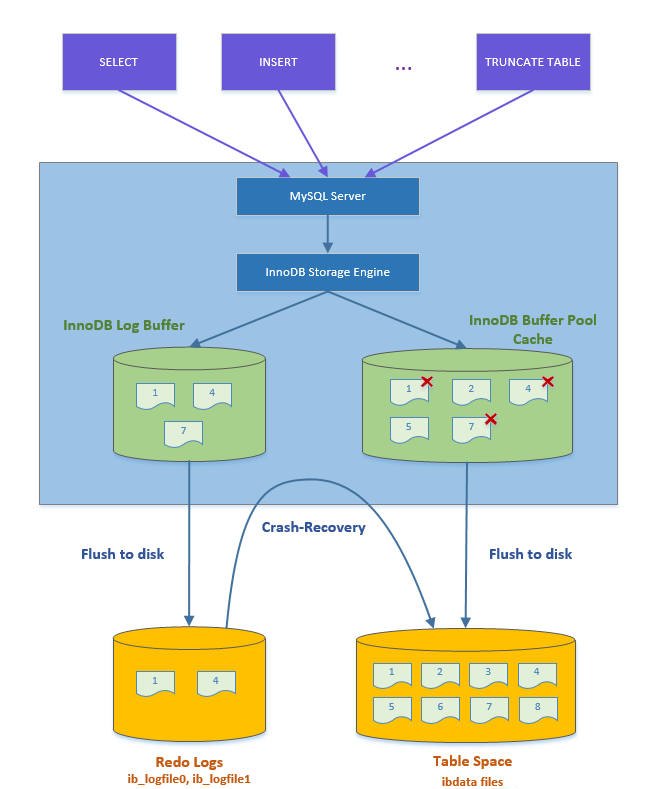

# Database from scratch written in Go

- Implement GoDB, a basic database management system.

## Introduction

- Base on labs of [course 6.5830/6.5831](http://dsg.csail.mit.edu/6.5830/).

- GoDB consists of:
  - Structures that represent fields, tuples, and tuple schemas;
  - Methods that apply predicates and conditions to tuples;
  - One or more access methods (e.g., heap files) that store relations on disk and provide a way to iterate through tuples of those relations;
  - A collection of operator classes (e.g., select, join, insert, delete, etc.) that process tuples;
  - A buffer pool that caches active tuples and pages in memory and handles concurrency control and transactions (neither of which you need to worry about for this lab); and,
  - A catalog that stores information about available tables and their schemas.

## Labs 1

- The main function of lab1 in this experiment is to access data stored on the disk.

### Tuple

- First, we will observation, try to pass all test in tuple_test.
- The Tuple struct in GoDB is used to store the in-memory value of a database tuple (or record).
  - We just support 2 type here: String and Int.
  - Tuple objects are created by the underlying access methods (e.g., heap files, or B-trees)
  - Support:
    - Projection: simply mean selecting from rows from table.

### BufferPool

- BP: in simple term, is used to read pages from disk and write them back to disk. The following diagram explains the working process of the buffer pool.

- It wasn't simple. Many required thing need to implement.

- The buffer pool (class BufferPool in GoDB) is responsible for caching pages in memory that have been recently read from disk. All operators read and write pages from various files on disk through the buffer pool. It consists of a fixed number of pages, defined by the numPages parameter to the BufferPool constructor NewBufferPool.
- For this lab, you only need to implement the constructor and the BufferPool.getPage() method used by the HeapFile iterator. The buffer pool stores structs that implement the Page interface; these pages can be read from underlying database files (such as a heap file) which implement the DBFile interface using the readPage method. The BufferPool should store up to numPages pages. If more than numPages requests are made for different pages, you should evict one of them according to an eviction policy of your choice. Note that you should not evict dirty pages (pages where the Page method isDirty() returns true), for reasons we will explain when we discuss transactions later in the class. You don't need to worry about locking in lab 1.

### HeapFile (access method - datastructure for organizing and accessing data on disk.)

- `Access method`: is a routine that manage access to the various diskbase ds, included (unorder files) heaps and B+tree index, hash index for equality lookup. multi-dimension index such as R-tree.
- Access methods provide a way to read or write data from disk that is arranged in a specific way. Common access methods include heap files (unsorted files of tuples) and B-trees
- A `HeapFile` object is arranged into a set of pages, each of which consists of a fixed number of bytes for storing tuples, (defined by the constant PageSize), including a header
  - 1 HeapFile Object for each table, each page hold a set of tuples.
- A `Page` are type **HeapPage** have implement the **Page** interface
  - Page are fixed size and Tuple are fixed size, so all pages hold the same number of tuples
- GoDB store heap file on disks as pages of data arrangement consecutively on disk. On disk, each page have header, follow by **PageSize**. Header consist 32 bit integer with the number of tuples, and second 32 bit integer with the number of used tuples.

### Heap page.

-

- Note that to process deletions you will likely delete tuples at a specific position (slot) in the heap page. This means that after a page is read from disk, tuples should retain the same slot number. Because GoDB will never evict a dirty page, it's OK if tuples are renumbered when they are written back to disk.

### 3 Thing above need to implement at the same time

- It still hard with the support of chatGPT.

- doan nay can lam song song nhieu thu de test duoc
  - test method nay dau tien
  - TestInsertHeapPage
- tupleIter() at heap page quite tricky.
