# Ôn tập: GoDB hoạt động như thế nào

File này giải thích lại **các cơ chế** trong GoDB theo đúng thứ tự dữ liệu đi qua hệ thống, và gắn mỗi phần với tên hàm trong code.
Đọc trên GitHub thì các khối `mermaid` sẽ hiện thành sơ đồ.

> Nên đọc file này trước, sau đó đọc [`review.md`](review.md) (những chỗ đang sai) rồi mới bắt tay vào sửa.

**Mục lục**

0. [Bức tranh tổng thể](#0-bức-tranh-tổng-thể)
1. [Lưu trữ: File → Page → Tuple](#1-lưu-trữ-file--page--tuple)
2. [Buffer Pool: tại sao cần, nó làm gì](#2-buffer-pool-tại-sao-cần-nó-làm-gì)
3. [Heap File: insert / delete / scan](#3-heap-file-insert--delete--scan)
4. [Thực thi query: mô hình Iterator](#4-thực-thi-query-mô-hình-iterator)
5. [Transaction và vì sao cần concurrency control](#5-transaction-và-vì-sao-cần-concurrency-control)
6. [Lock và Two-Phase Locking (2PL)](#6-lock-và-two-phase-locking-2pl)
7. [Deadlock: phát hiện và xử lý](#7-deadlock-phát-hiện-và-xử-lý)
8. [Commit / Abort và Recovery (FORCE, STEAL)](#8-commit--abort-và-recovery-force-steal)
9. [Lock vs Latch](#9-lock-vs-latch)
10. [Ghép lại: vòng đời một câu `DELETE`](#10-ghép-lại-vòng-đời-một-câu-delete)
11. [Bảng tra cứu: khái niệm → code](#11-bảng-tra-cứu-khái-niệm--code)

---

## 0. Bức tranh tổng thể

Một câu SQL đi qua các tầng sau. Mỗi tầng chỉ nói chuyện với tầng ngay dưới nó.

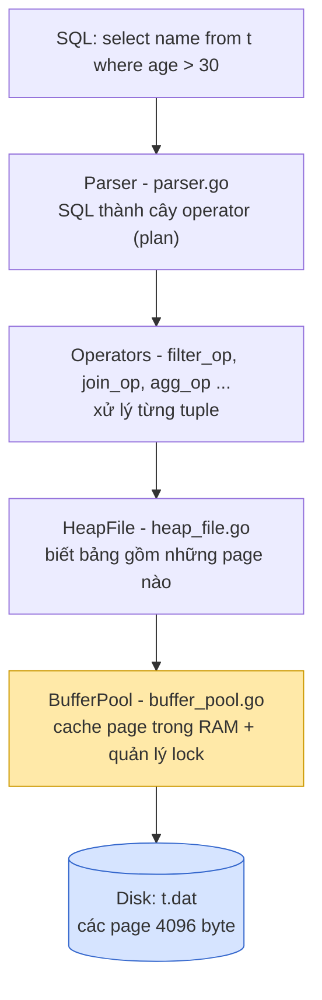

Ý tưởng cốt lõi:

- **Disk lưu theo page**: đọc/ghi luôn cả khối 4096 byte, không đọc lẻ từng dòng.
- **Buffer Pool là cửa duy nhất** để lấy page. Mọi tầng trên đều phải gọi `GetPage`, không ai đọc file trực tiếp (trừ chính buffer pool thông qua `readPage`).
- Vì mọi truy cập đều đi qua buffer pool, nó cũng là chỗ đặt **lock** cho transaction.

---

## 1. Lưu trữ: File → Page → Tuple

### 1.1 Một bảng = một file = nhiều page

```
 t.dat (trên disk)
 ┌──────────────┬──────────────┬──────────────┬──────────────┐
 │   page 0     │   page 1     │   page 2     │   page 3     │
 │  4096 byte   │  4096 byte   │  4096 byte   │  4096 byte   │
 └──────────────┴──────────────┴──────────────┴──────────────┘
 offset:  0          4096           8192          12288

 offset của page n = n × PageSize          (readPage / flushPage)
 số page          = kích thước file / 4096  (NumPages)
```

### 1.2 Bên trong một page (`heap_page.go`)

Ví dụ bảng `t(name string, age int)`:

- `name`: string cố định `StringLength = 32` byte
- `age`: int64 = 8 byte
- 1 tuple = 40 byte → số slot = (4096 − 8) / 40 = **102 slot**

```
 ┌───────────────────── page (4096 byte) ─────────────────────┐
 │ header 8 byte                                              │
 │ ┌──────────────┬──────────────┐                            │
 │ │ numSlots=102 │ usedSlots=3  │   int32 + int32            │
 │ └──────────────┴──────────────┘                            │
 │ slot 0: [ "sam"............ | 25 ]   40 byte               │
 │ slot 1: [ "kathy".......... | 45 ]                         │
 │ slot 2: [ "bill"........... | 30 ]                         │
 │ slot 3: (trống)                                            │
 │ ...                                                        │
 │ slot 101: (trống)                                          │
 │ phần thừa (padding 0)                                      │
 └────────────────────────────────────────────────────────────┘
```

Vì mọi tuple **cùng kích thước**, ta tính được vị trí từng slot mà không cần thêm thông tin gì. Đó là lý do GoDB cắt string về đúng 32 byte.

### 1.3 Page trên disk ↔ page trong RAM

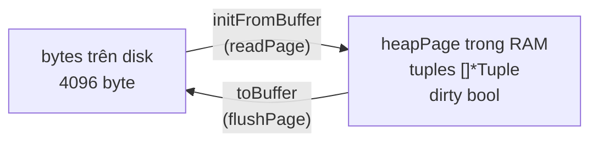

Trong RAM, page là một struct Go có thêm trạng thái mà disk không có:

- `dirty`: page đã bị sửa nhưng **chưa ghi ra disk**
- `tuples[i]`: con trỏ tới tuple (hoặc `nil` nếu slot trống)

### 1.4 RecordID: "địa chỉ" của một dòng

```
 RecordID = (pageNo, slotNo)

 (1, 2)  →  file t.dat, page 1, slot 2
```

Iterator gán `Rid` cho mỗi tuple nó trả ra. Khi `DELETE`, ta không tìm theo giá trị mà đi thẳng tới `Rid`, giống như có địa chỉ nhà thì không cần đi hỏi từng nhà.

---

## 2. Buffer Pool: tại sao cần, nó làm gì

### 2.1 Vấn đề: disk chậm hơn RAM rất nhiều

| Thao tác | Thời gian xấp xỉ | Nếu 1 ns = 1 giây thì... |
|----------|------------------|--------------------------|
| Đọc RAM | 100 ns | ~1.5 phút |
| Đọc SSD (1 page) | 100 µs | ~1 ngày |
| Đọc HDD (1 page) | 10 ms | ~4 tháng |

Nếu mỗi lần cần một dòng mà phải đọc từ disk thì DB sẽ cực chậm. Trong khi đó, các query thường **dùng lại cùng một page nhiều lần**:

- Nested loop join quét lại bảng phải hàng ngàn lần.
- Insert 100 dòng liên tiếp đều vào cùng page cuối.
- Nhiều transaction cùng đọc các bảng "nóng".

### 2.2 Giải pháp: giữ page trong RAM, nhưng RAM có hạn

```
                 BufferPool (numPages = 4)
   ┌────────────────────────────────────────────────┐
   │  key (file, pageNo)     →   *Page   dirty?     │
   │  ("t.dat", 0)           →   page    no         │
   │  ("t.dat", 1)           →   page    YES  ✎     │
   │  ("t2.dat", 0)          →   page    no         │
   │  ("t2.dat", 5)          →   page    no         │
   └────────────────────────────────────────────────┘
          ▲ hit: trả luôn, không đụng disk
          │
          │ miss: đọc từ disk, nếu đầy thì phải đuổi (evict) 1 page
          ▼
   ┌──────────────────────────────┐
   │ Disk: t.dat, t2.dat, ...     │
   └──────────────────────────────┘
```

### 2.3 Buffer pool có **4 tác dụng**, không chỉ là cache

| # | Tác dụng | Trong GoDB |
|---|----------|------------|
| 1 | **Cache**: giảm số lần đọc disk | `bp.pages` map |
| 2 | **Giới hạn bộ nhớ**: DB không dùng RAM vô hạn | `numPages`, evict khi đầy |
| 3 | **Chỉ một bản copy cho mỗi page**: mọi transaction cùng thấy một object page, sửa ở đâu thì người khác thấy ở đó | map theo key `heapHash{FileName, PageNo}` |
| 4 | **Điểm kiểm soát cho transaction**: lock page, và quyết định *khi nào* page dirty được ghi xuống disk (ảnh hưởng recovery) | `handleTransactionInGetPage`, `CommitTransaction`, chính sách evict |

Tác dụng số 3 rất quan trọng: nếu mỗi nơi tự đọc file ra một bản copy riêng thì T1 sửa bản của T1, T2 sửa bản của T2, và khi ghi xuống disk người ghi sau sẽ đè mất của người ghi trước.

### 2.4 Luồng `GetPage`

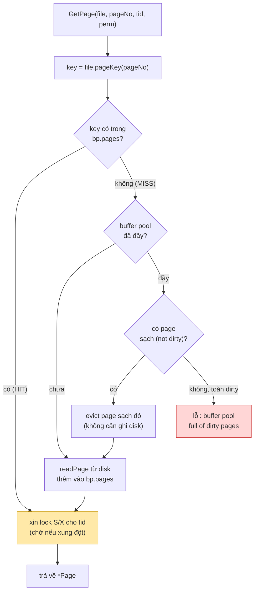

### 2.5 Tại sao không evict page dirty?

Page dirty chứa thay đổi **của một transaction chưa commit**. Nếu ghi nó ra disk rồi transaction đó abort, trên disk sẽ có dữ liệu "rác" mà không có cách nào hoàn tác (GoDB không có log).
Chính sách này gọi là **NO-STEAL**, xem thêm ở [mục 8](#8-commit--abort-và-recovery-force-steal).

### 2.6 Chọn page nào để evict?

GoDB lấy page sạch **đầu tiên gặp trong map**, mà thứ tự duyệt map của Go là ngẫu nhiên. DB thật dùng chính sách thông minh hơn:

- **LRU**: đuổi page lâu nhất chưa dùng.
- **Clock**: xấp xỉ LRU nhưng rẻ hơn.
- **LRU-K**, **2Q**: tránh việc một lần full scan đẩy hết page "nóng" ra ngoài.

---

## 3. Heap File: insert / delete / scan

"Heap" ở đây nghĩa là **đống không có thứ tự**: dòng mới được đặt vào bất kỳ slot trống nào.

### 3.1 Insert (`HeapFile.insertTuple`)

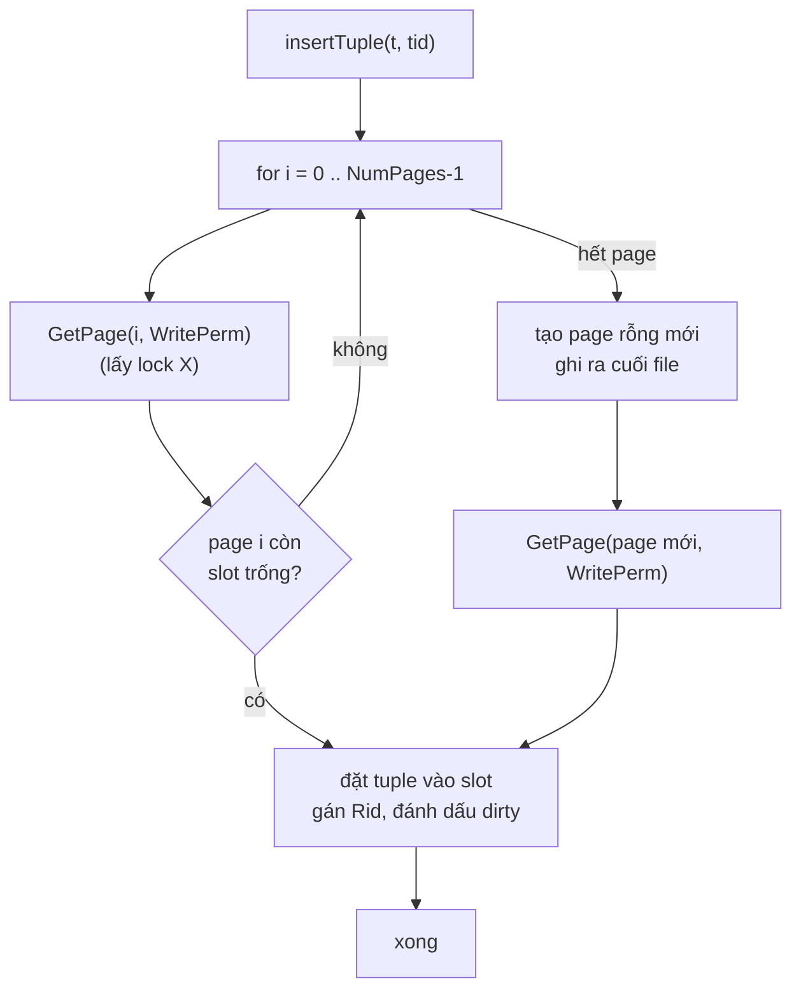

Lưu ý: `insertTuple` **chỉ sửa page trong RAM** và đánh dấu dirty, không ghi disk. Việc ghi disk xảy ra lúc commit.

### 3.2 Delete (`HeapFile.deleteTuple`)

```
 deleteTuple(t)
   rid = t.Rid                      → (pageNo=1, slot=2)
   page = GetPage(1, WritePerm)     → lock X page 1
   page.tuples[2] = nil, dirty=true
```

Không cần quét gì cả, nhờ có Rid.

### 3.3 Scan (`HeapFile.Iterator`)

```
 page0: [A][B][ ][C]     page1: [D][ ][E]
         ▲  ▲     ▲              ▲     ▲
         1  2     3              4     5     → trả lần lượt A,B,C,D,E rồi nil
```

Mỗi page đều được lấy qua `GetPage(ReadPerm)`, nên khi scan transaction cũng nhận lock S lên mọi page nó đọc.

---

## 4. Thực thi query: mô hình Iterator

### 4.1 Plan là một cây operator

Câu `select name from t where age > 30 limit 2` trở thành:

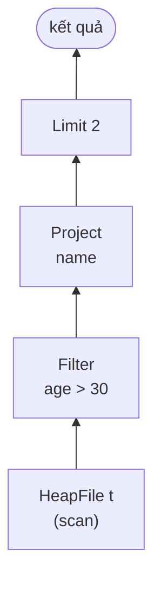

Mỗi operator đều có cùng interface (`types.go`):

```go
type Operator interface {
    Descriptor() *TupleDesc                               // schema đầu ra
    Iterator(tid TransactionID) (func() (*Tuple, error), error)
}
```

### 4.2 Kéo từng tuple (pull / Volcano model)

Operator cha gọi `next()` (tức hàm iterator) của operator con. Không ai đọc hết dữ liệu trước: **mỗi lần chỉ có một tuple chảy lên**.

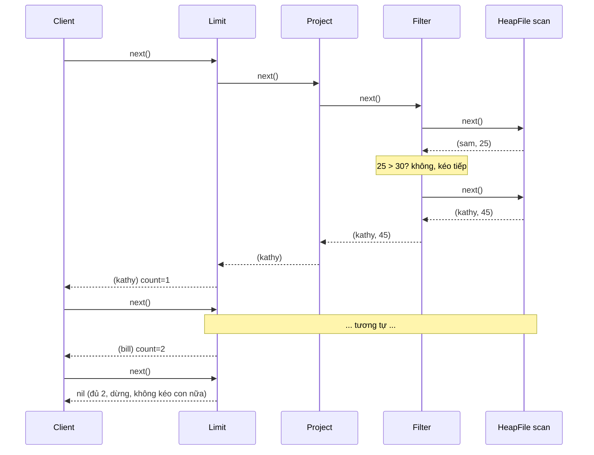

Lợi ích:

- **Ít bộ nhớ**: không cần chứa toàn bộ bảng trung gian.
- **Dừng sớm**: `Limit` đủ thì không đọc tiếp.
- **Ghép tự do**: mọi operator đều cùng interface nên có thể lắp thành cây bất kỳ.

### 4.3 Operator nào phải "chặn" (blocking)?

Một số operator **phải đọc hết input** rồi mới trả được tuple đầu tiên:

| Operator | Kiểu | Lý do |
|----------|------|-------|
| Filter, Project, Limit | streaming | xử lý từng tuple độc lập |
| Join (nested loop) | streaming bên trái, quét lại bên phải | |
| OrderBy | **blocking** | phải thấy hết mới biết dòng nào nhỏ nhất |
| Aggregate (sum, count, group by) | **blocking** | phải cộng hết mới có tổng |
| Insert, Delete | **blocking** | trả về 1 dòng `count` sau khi làm xong |

### 4.4 Join

```
 Nested loop join (GoDB đang dùng)          Hash join
 ─────────────────────────────────         ─────────────────────────
 for l in Left:                            1. Build: đọc Right, đưa vào
     for r in Right:   ← quét lại              hash table theo key join
         if l.k == r.k: emit                2. Probe: với mỗi l in Left,
                                               tra H[l.k] → emit
 Chi phí: |L| × |R|                         Chi phí: |L| + |R|
```

---

## 5. Transaction và vì sao cần concurrency control

### 5.1 ACID

| Chữ | Ý nghĩa | Trong GoDB, cơ chế nào đảm bảo |
|-----|---------|--------------------------------|
| **A**tomicity | làm hết hoặc không làm gì | abort thì bỏ page dirty (NO-STEAL) |
| **C**onsistency | dữ liệu luôn hợp lệ | do A + I + logic của ứng dụng |
| **I**solation | chạy song song mà kết quả như chạy lần lượt | **Strict 2PL** (lock page) |
| **D**urability | commit rồi thì không mất | FORCE: ghi page ra disk khi commit |

### 5.2 Không có lock thì chuyện gì xảy ra?

Ví dụ chuyển tiền (cũng có trong `README.md`). Ban đầu A = 300, B = 200, tổng = 500.

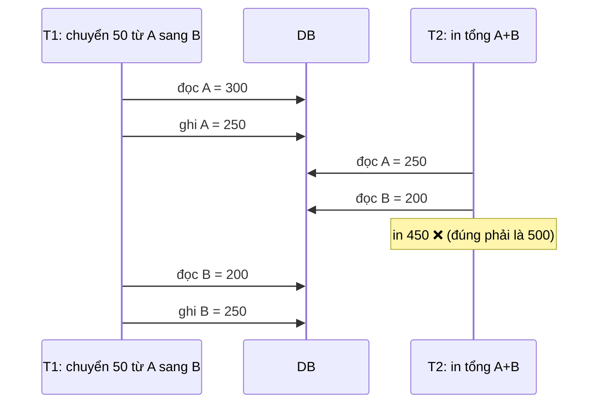

T2 nhìn thấy trạng thái "nửa vời" của T1. Mục tiêu của concurrency control: **kết quả phải giống như chạy T1 rồi T2, hoặc T2 rồi T1** (gọi là *serializable*).

---

## 6. Lock và Two-Phase Locking (2PL)

### 6.1 Hai loại lock

- **S (Shared / ReadPerm)**: để đọc. Nhiều transaction cùng đọc được.
- **X (Exclusive / WritePerm)**: để ghi. Chỉ một transaction giữ, không ai khác được đọc hay ghi.

```
                 người khác đang giữ
                   S          X
 tôi xin  S      ✅ được     ❌ chờ
          X      ❌ chờ      ❌ chờ
```

Trong GoDB, `GetPage(..., ReadPerm)` xin S và `GetPage(..., WritePerm)` xin X. Logic kiểm tra nằm trong `isConflicted`.

**Lock upgrade**: T1 đang giữ S trên page P, giờ muốn ghi thì xin X. Được ngay nếu không ai khác giữ S trên P; nếu có thì phải chờ họ nhả.

### 6.2 Chỉ có lock thôi là chưa đủ, phải có luật 2PL

Nếu lấy lock xong nhả ngay thì vẫn có thể ra lịch không serializable (hình trên). Luật **2PL**: *đã nhả một lock thì không được xin thêm lock nào nữa*.

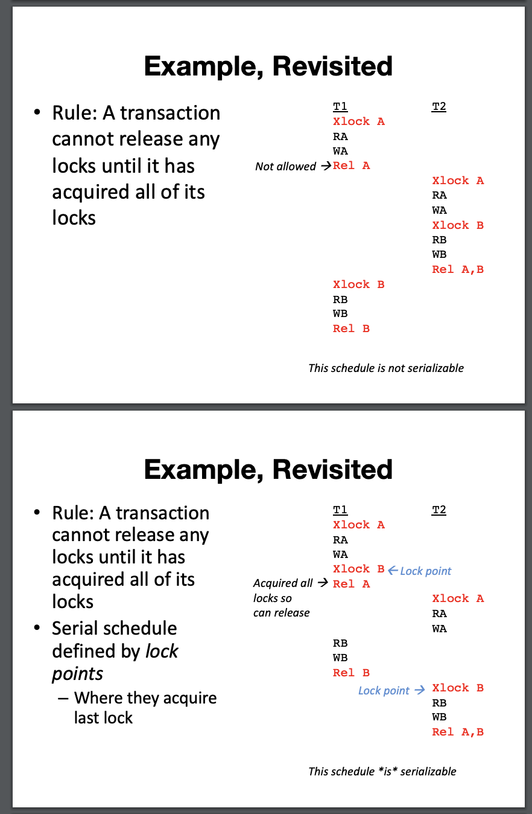

```
 số lock đang giữ
   ▲
   │        ╱‾‾‾‾‾╲
   │       ╱       ╲
   │      ╱         ╲
   │     ╱           ╲
   │____╱_____________╲______▶ thời gian
        growing   ▲  shrinking
        (chỉ xin) │  (chỉ nhả)
              lock point
```

### 6.3 Strict 2PL: giữ lock tới khi commit/abort

2PL thường vẫn có vấn đề **cascading abort**: T1 nhả lock A sớm, T2 đọc giá trị A mà T1 đã ghi; sau đó T1 abort thì T2 đã đọc dữ liệu "không tồn tại" và cũng phải abort theo.

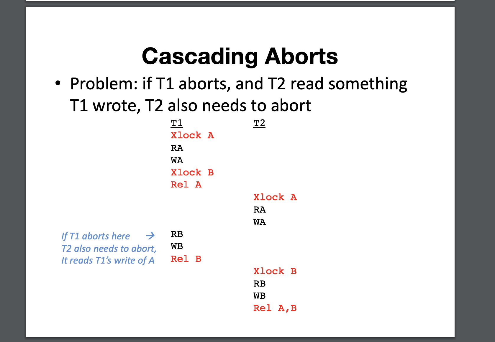

**Strict 2PL**: giữ **tất cả** lock cho tới lúc commit/abort mới nhả hết một lần. GoDB làm đúng như vậy: lock chỉ được xoá trong `CommitTransaction` và `AbortTransaction` (`delete(bp.mapPageLocksByTid, tid)`).

```
 số lock
   ▲          ┌──────────┐
   │        ╱ │          │
   │      ╱   │          │
   │    ╱     │          │   nhả hết cùng lúc
   │__╱_______│__________│_____▶
     growing          commit
```

### 6.4 Cấu trúc dữ liệu lock trong GoDB

```
 mapPageLocksByTid                       waitTidLocks  (ai đang chờ ai)
 ┌──────┬──────────────────────────┐     ┌──────┬──────────────┐
 │ T1   │ (t.dat,0): X             │     │ T2   │ { T1 }       │  T2 chờ T1
 │      │ (t.dat,1): S             │     │ T3   │ { T1, T2 }   │
 ├──────┼──────────────────────────┤     └──────┴──────────────┘
 │ T2   │ (t.dat,1): S             │
 └──────┴──────────────────────────┘
```

### 6.5 Khi phải chờ lock

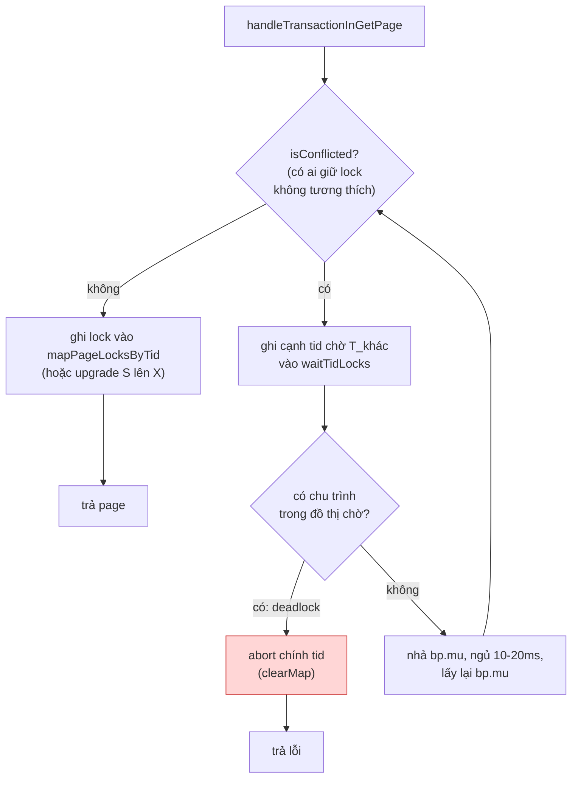

---

## 7. Deadlock: phát hiện và xử lý

### 7.1 Deadlock là gì

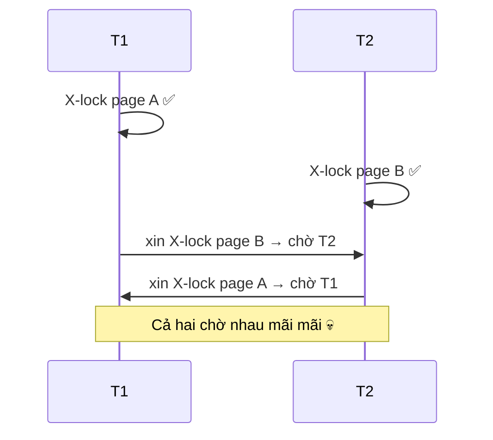

### 7.2 Waits-for graph

Mỗi transaction là một đỉnh, có cạnh `Ti → Tj` nếu Ti đang chờ lock mà Tj giữ. **Deadlock ⇔ đồ thị có chu trình.**

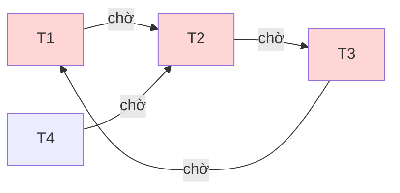

T1 → T2 → T3 → T1 là chu trình, nên deadlock. T4 chỉ đang chờ, không nằm trong chu trình, và sẽ chạy tiếp khi chu trình được phá.

GoDB dùng DFS (`deadLockPrevent`) xuất phát từ transaction đang xin lock. Nếu đi một vòng mà quay lại được chính nó thì có chu trình, và transaction đó tự abort (nó là **nạn nhân**).

### 7.3 Các cách xử lý deadlock

| Cách | Ý tưởng | Ưu / nhược |
|------|---------|------------|
| **Detection** (GoDB) | dựng waits-for graph, tìm chu trình, abort một txn | chính xác, nhưng tốn công dựng đồ thị |
| **Timeout** | chờ quá X ms thì tự abort | đơn giản, nhưng có thể abort oan |
| **Wait-Die / Wound-Wait** | so tuổi txn (timestamp) để quyết định chờ hay abort | không bao giờ deadlock, nhưng abort nhiều hơn cần |

Sau khi bị abort, client nên **thử lại** transaction. Lúc này txn kia đã chạy xong nên thường sẽ thành công.

---

## 8. Commit / Abort và Recovery (FORCE, STEAL)

### 8.1 Hai câu hỏi thiết kế

1. **STEAL?** Có được ghi page dirty của txn **chưa commit** ra disk không? (ví dụ khi buffer pool đầy cần chỗ)
2. **FORCE?** Khi commit, có **bắt buộc** ghi hết page dirty của txn ra disk không?

```
                       NO-STEAL                     STEAL
                 ┌───────────────────────┬───────────────────────┐
     FORCE       │  không cần UNDO        │  cần UNDO             │
                 │  không cần REDO        │  không cần REDO       │
                 │  ★ GoDB                │                       │
                 ├───────────────────────┼───────────────────────┤
     NO-FORCE    │  không cần UNDO        │  cần UNDO + REDO      │
                 │  cần REDO              │  ★ Postgres, MySQL    │
                 └───────────────────────┴───────────────────────┘
                   ▲ dễ làm nhưng chậm         ▲ nhanh nhưng cần WAL
```

### 8.2 Commit trong GoDB (FORCE)

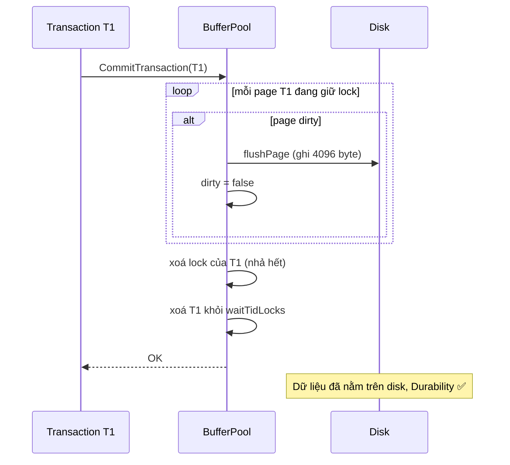

### 8.3 Abort trong GoDB (NO-STEAL)

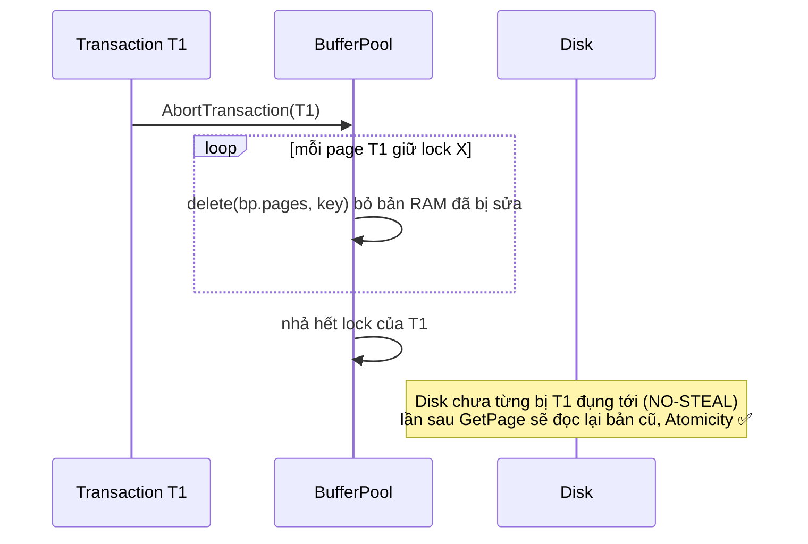

Abort rẻ như vậy chính là nhờ NO-STEAL: bản "đúng" vẫn nằm nguyên trên disk, chỉ cần vứt bản trong RAM đi.

### 8.4 Cái giá và cách DB thật làm (WAL)

- NO-STEAL: txn sửa nhiều page hơn kích thước buffer pool thì **không chạy được**.
- FORCE: mỗi commit phải ghi ngẫu nhiên nhiều page, **chậm**.

DB thật dùng **Write-Ahead Log**: trước khi sửa page, ghi một dòng log tuần tự (rẻ) dạng *"T1 đổi A từ 300 thành 250"*.

```
 Luật WAL:
   1. Log của một thay đổi phải nằm trên disk TRƯỚC page chứa thay đổi đó   → cho phép STEAL (UNDO được)
   2. Commit = ghi log record COMMIT ra disk, page thì ghi sau cũng được     → cho phép NO-FORCE (REDO được)

 Crash xong khởi động lại (ARIES):
   Analysis → REDO mọi thứ trong log → UNDO các txn chưa commit
```

GoDB bỏ qua phần này với giả định *không crash trong lúc commit*.

---

## 9. Lock vs Latch

Có hai thứ đều gọi là "khoá" nhưng mục đích khác nhau:

```
 LOCK (logic, cho transaction)                LATCH (vật lý, cho thread)
 ─────────────────────────────               ─────────────────────────────
 bảo vệ: dữ liệu (page t.dat#1)              bảo vệ: cấu trúc trong RAM (map bp.pages)
 giữ:    tới commit/abort (giây, phút)        giữ:    vài micro giây
 GoDB:   mapPageLocksByTid (S/X)              GoDB:   bp.mu, f.mu (sync.Mutex)
 deadlock: phát hiện + abort                  deadlock: phải tránh bằng thứ tự lấy
```

Ví dụ: T1 giữ **lock** X trên page 1 suốt 5 giây. Trong 5 giây đó, T2 vẫn cần lấy **latch** `bp.mu` vài micro giây để kiểm tra "page 1 đang bị ai lock?". Vì vậy khi phải chờ lock, code **phải nhả latch** trước khi ngủ (`waitWhenConflict` có làm `bp.mu.Unlock()`). Nếu không, T1 sẽ không bao giờ lấy được `bp.mu` để commit và nhả lock, và cả hệ thống đứng im.

---

## 10. Ghép lại: vòng đời một câu `DELETE`

`delete from t where age > 40`, chạy trong transaction T1:

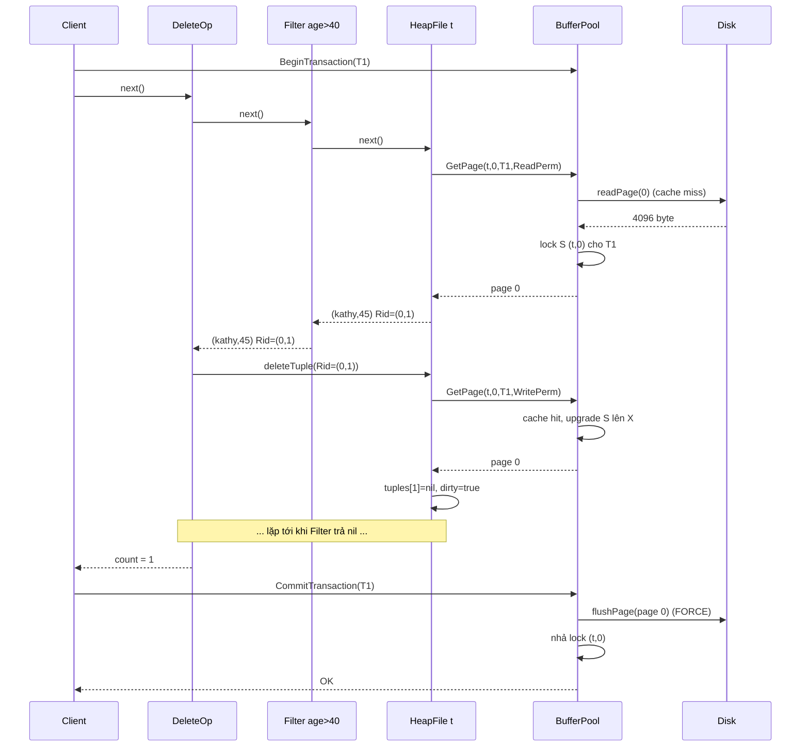

Trong ví dụ này có đủ mọi thứ đã ôn:

1. **Iterator**: Delete kéo Filter, Filter kéo Scan.
2. **Buffer pool**: miss thì đọc disk, các lần sau là hit.
3. **Lock**: S khi đọc, upgrade lên X khi xoá.
4. **RecordID**: xoá thẳng tới `(0,1)`.
5. **Dirty page**: chỉ sửa trong RAM.
6. **Strict 2PL + FORCE**: tới commit mới ghi disk và nhả lock.

---

## 11. Bảng tra cứu: khái niệm → code

| Khái niệm | File | Hàm / field |
|-----------|------|-------------|
| Kích thước page, string | `godb/types.go` | `PageSize = 4096`, `StringLength = 32` |
| Interface Page / DBFile / Operator | `godb/types.go` | `Page`, `DBFile`, `Operator` |
| Bố cục page, slot | `godb/heap_page.go` | `newHeapPage`, `toBuffer`, `initFromBuffer` |
| RecordID | `godb/heap_page.go` | `insertTuple` gán `Rid` |
| Đọc/ghi page từ disk | `godb/heap_file.go` | `readPage`, `flushPage` |
| Insert / delete / scan | `godb/heap_file.go` | `insertTuple`, `deleteTuple`, `Iterator` |
| Key của page trong cache | `godb/heap_file.go` | `pageKey` → `heapHash` |
| Cache + evict | `godb/buffer_pool.go` | `GetPage` |
| Lock S/X, upgrade | `godb/buffer_pool.go` | `isConflicted`, `saveMapAndUpgradeLock` |
| Chờ lock | `godb/buffer_pool.go` | `waitWhenConflict` |
| Deadlock detection | `godb/buffer_pool.go` | `waitTidLocks`, `deadLockPrevent` |
| Commit (FORCE) | `godb/buffer_pool.go` | `CommitTransaction` |
| Abort (NO-STEAL) | `godb/buffer_pool.go` | `AbortTransaction`, `clearMap` |
| Parser → plan | `godb/parser.go` | `Parse` |
| Operators | `godb/*_op.go` | `Iterator` của từng operator |

---

### Câu hỏi tự kiểm tra (trả lời được hết là sẵn sàng để fix)

1. Tại sao `GetPage` không được evict page dirty? Nếu evict thì điều gì xảy ra khi txn đó abort?
2. Hai transaction cùng đọc page 0 có chờ nhau không? Nếu một trong hai muốn ghi thì sao?
3. Vì sao Strict 2PL nhả lock lúc commit chứ không nhả ngay sau khi dùng xong page?
4. Vẽ waits-for graph cho: T1 giữ X(A) và chờ B; T2 giữ X(B) và chờ C; T3 giữ X(C). Có deadlock không? Nếu T3 xin thêm A thì sao?
5. Tại sao key của page phải gồm **cả tên file** lẫn `pageNo`? (gợi ý: [`review.md` mục 2](review.md#2-lock-table-page-phải-được-định-danh-bằng-file-pageno-không-chỉ-pageno-))
6. `OrderBy` có dừng sớm được như `Limit` không? Vì sao?
7. Nếu GoDB chuyển sang STEAL thì cần thêm gì để abort vẫn đúng?
